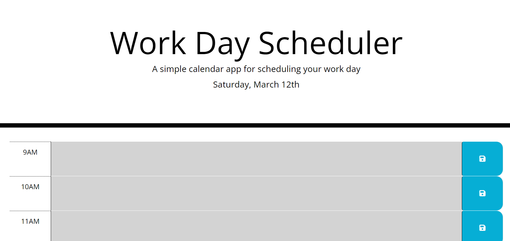
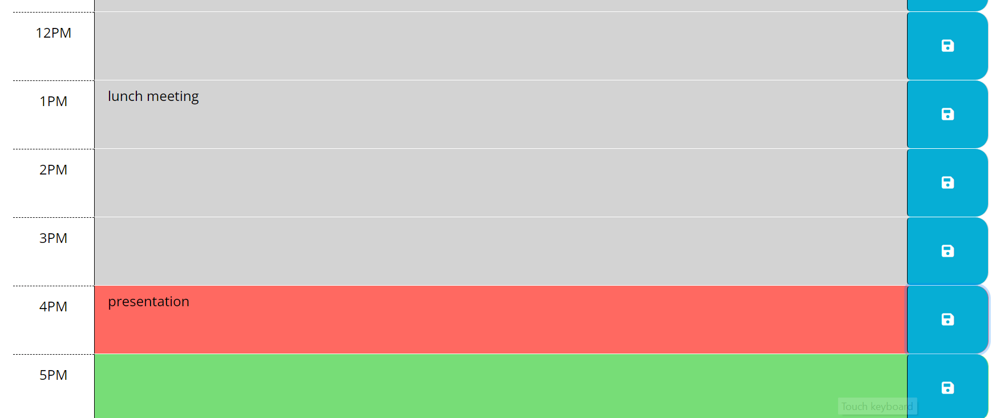

# Work Day Scheduler

## Description

The Work Day Scheduler app allows the user to schedule tasks to be done during that day's working hours. This allows the user to manage their time well and schedule individual untimed tasks around meetings and other timed appoinments they have.

The Scheduler displays the current date and time blocks for the standard business hours, 9:00 am to 5:00 pm. Each of the time blocks have a background color assigned to them depending on the current time of day and whether that hour has passed (gray), is the current hour (red), or is in the future (green). The user can enter text into the time blocks and the text is saved in localStorage, along with the corresponding hour, when the save button is clicked. When the webpage is reloaded, the text is retrieved from localStorage and displayed in the corresponding hour time block.

## Screenshots

## Website

[https://emilyk221.github.io/Work-Day-Scheduler/](https://emilyk221.github.io/Work-Day-Scheduler/)

## Resources

I used the following resources:
- [moment.js documentation](https://momentjs.com/docs/#/displaying/)
- [bootstrap documentation](https://getbootstrap.com/docs/5.1/layout/grid/)
- [jquery API documentation](https://api.jquery.com/)
- [stack overflow questions](https://stackoverflow.com/questions)
- [w3 schools: findIndex](https://www.w3schools.com/jsref/jsref_findindex.asp#:~:text=The%20findIndex()%20method%20executes,function%20for%20empty%20array%20elements.)